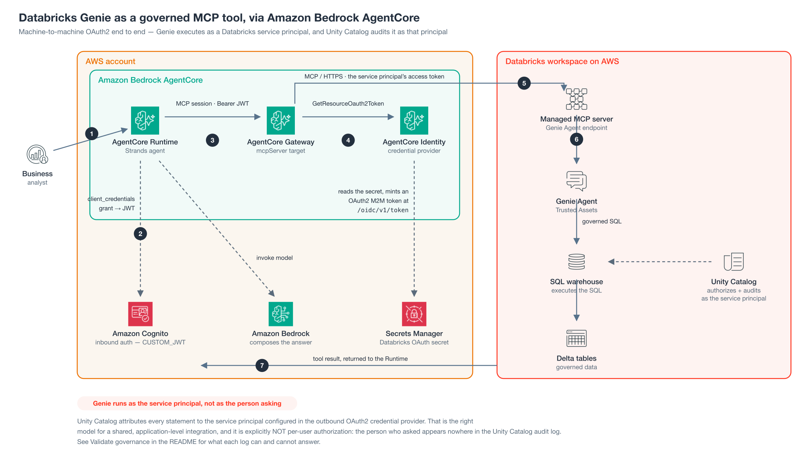
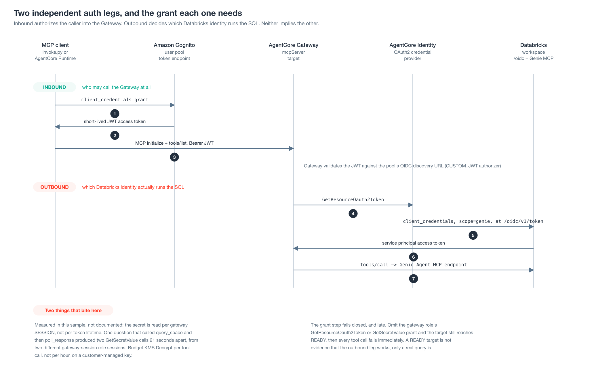
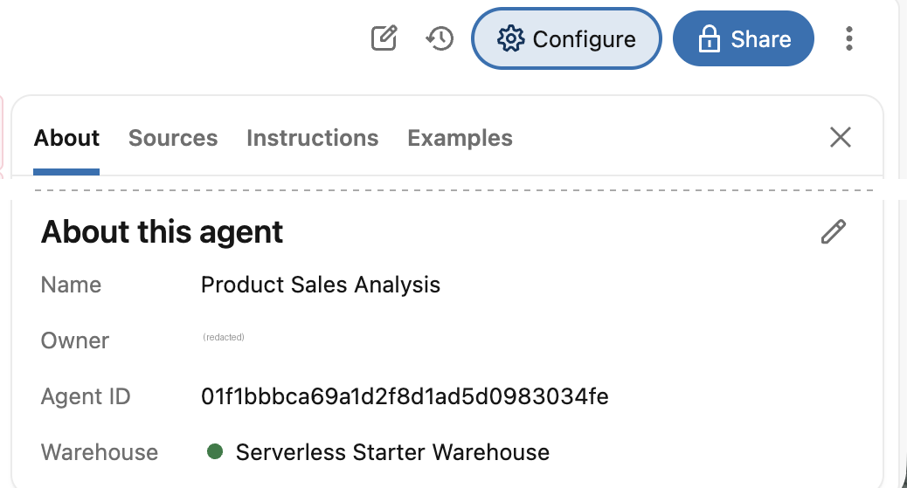

# Databricks Genie via Amazon Bedrock AgentCore Gateway (MCP)

Expose a [Databricks Genie Agent](https://docs.databricks.com/aws/en/genie-agents) as a governed MCP tool to AI agents through [Amazon Bedrock AgentCore Gateway](https://docs.aws.amazon.com/bedrock-agentcore/latest/devguide/gateway.html), with the agent hosted on [AgentCore Runtime](https://docs.aws.amazon.com/bedrock-agentcore/latest/devguide/runtime.html). Agents ask plain-English business questions; Genie returns lakehouse-native SQL answers grounded in Unity Catalog. The gateway authenticates to Databricks as a service principal (machine-to-machine), so queries run with — and are audited under — that service principal's Unity Catalog permissions.



**Call flow** (the numbers in the figure above). A Strands agent on AgentCore Runtime takes a business analyst's question (1) and
mints a Cognito token with a client-credentials grant (2), then opens an MCP session to AgentCore
Gateway with that token as a bearer JWT (3). The Gateway asks AgentCore Identity for the Databricks
credential (4); Identity reads the OAuth secret from Secrets Manager and mints a service-principal
access token at the workspace's `/oidc/v1/token`. The Gateway calls the managed Genie MCP endpoint
with that token (5), and inside the workspace the Genie Agent generates SQL, the SQL warehouse runs
it, and Unity Catalog authorizes and audits every read as the service principal (6). The tool result
returns to the Runtime, whose agent has a Bedrock model compose the answer (7).

<sub>Diagram source: [`images/architecture.svg`](images/architecture.svg), generated by
[`images/build_architecture.py`](images/build_architecture.py). The two-auth-legs figure under
Overview is [`images/auth-legs.svg`](images/auth-legs.svg), from
[`images/build_auth_legs.py`](images/build_auth_legs.py). The Amazon Bedrock, Amazon Cognito and
AWS Secrets Manager marks are from the official
[AWS Architecture Icons](https://aws.amazon.com/architecture/icons/) toolkit; the Amazon Bedrock
AgentCore mark is a separate brand export. To change either diagram, edit its builder and re-run
it from `images/` (the architecture builder reads the committed `icons_b64.json` cache, and the
auth-legs builder uses no icons, so neither needs the icon toolkit on disk), then regenerate the
PNG, for example
`rsvg-convert -w 2064 architecture.svg -o architecture.png`. Both are vector, so they render at
any width: use `-w 1872` for a 2x asset on a page that serves images at 936px.</sub>

## Overview

This sample registers the [Databricks-managed Genie MCP endpoint](https://docs.databricks.com/aws/en/agents/mcp-tools/managed-mcp) (`/api/2.0/mcp/genie/{space_id}`) as a target in Amazon Bedrock AgentCore Gateway. Once registered, any agent authorized to the gateway can call Genie as a tool — no custom NL-to-SQL chain, no data copy into Knowledge Bases, no parallel metric definitions. The gateway manages:

- **Inbound auth** — AgentCore Identity (fronted by Amazon Cognito in this sample) authorizes agent → tool calls
- **Outbound auth** — Databricks OAuth2 M2M credentials, registered via `CreateOauth2CredentialProvider` (scoped to `genie`) and retrieved by Gateway at tool-invocation time
- **Audit** — Unity Catalog audit logs attribute SQL execution to the service principal; AgentCore Runtime and Gateway emit CloudWatch traces for each tool invocation



<sub>This figure numbers its own sequence, separately from the call flow under the architecture
figure.</sub>

> **Auth model.** This sample uses machine-to-machine (client-credentials) auth end to end, so Genie runs as the service principal, and Unity Catalog audit attributes every query to that service principal — not to the person who asked. That is the right model for a shared, application-level integration where all callers share one permission set. It also means **this sample does not give you per-user authorization**.
>
> Per-user authorization is out of scope for this sample and is not something it has been tested with. If you adapt it for per-user identity, note that Databricks gates the OAuth token-exchange grant behind an **account federation policy** trusting the token issuer — without one, a token-exchange request against the workspace returns `invalid_grant` with `Failed to process token: TOKEN_INVALID (Ensure a valid federation policy has been configured)`. Configure that first, then confirm in the Unity Catalog audit logs **whose identity actually reached Unity Catalog** rather than inferring it from the grant type. See the [outbound authorization matrix](https://docs.aws.amazon.com/bedrock-agentcore/latest/devguide/gateway-outbound-auth.html) for what each target type supports.

## Prerequisites

> **One deployment per AWS account.** This sample uses fixed resource names (gateway,
> IAM role, inline policy, credential provider), which keeps the walkthrough readable but
> means a second deployment adopts the same role name and overwrites the shared inline
> policy, breaking the first deployment's tool calls. `deploy.py` fails loudly if it finds
> an adopted role belonging to another region; it cannot detect a concurrent deployment in
> the same region. Tear one down with `cleanup.py` before standing up another.

1. AWS credentials configured (`aws configure`) with permissions to create AgentCore resources and IAM roles, plus **Bedrock access to a current model**. The default is the `global.anthropic.claude-sonnet-5` cross-region inference profile; override it with `MODEL_ID`. Note that current Anthropic profile ids carry no date/version suffix — `global.anthropic.claude-sonnet-5` is the whole id. Confirm what your own account can call with `aws bedrock list-inference-profiles`; Bedrock can gate an older model line on an account that has not called it recently, and that surfaces as a `ResourceNotFoundException` on your first question rather than as a model-access error.
2. Databricks workspace on AWS with Unity Catalog enabled and at least one [Genie Agent](https://docs.databricks.com/aws/en/genie-agents) with Trusted Assets defined
3. Databricks service principal with an [OAuth M2M secret](https://docs.databricks.com/aws/en/dev-tools/auth/oauth-m2m). The service principal needs **all three** of the following — see [Service principal permissions](#service-principal-permissions) below, as a missing grant does not surface until the first real query:
   - `CAN_RUN` on the Genie Agent
   - `CAN_USE` on the SQL warehouse that backs the Genie Agent
   - `USE CATALOG` / `USE SCHEMA` / `SELECT` on the tables behind it
4. Python 3.10+ (`pip install -r requirements.txt`), and `jq`, used by the optional id
   lookup under Configuration
5. Step 4 of the walkthrough pins the container deployment path, which builds through CodeBuild,
   so the principal running it also needs ECR, CodeBuild and S3 permissions covering the
   repository, build project and source bucket the toolkit auto-creates, plus `iam:PassRole` on
   the execution role, which `CreateProject` is handed rather than creating

### Service principal permissions

Grant all three before running `deploy.py`. They fail at two different stages, so watch for
both:

- **Genie Agent `CAN_RUN`** is needed just to read the agent. Without it `deploy.py` cannot
  register the target at all — the target ends in **`FAILED`** (not `READY`) with
  `PERMISSION_DENIED: ... does not have read permission` on the agent.
- **Warehouse `CAN_USE`** and **UC `SELECT`** are easy to miss: `tools/list` succeeds without
  them and the target still reaches `READY`, so the integration looks healthy right up until
  the first real query fails. The
  [set-up docs](https://docs.databricks.com/aws/en/genie-agents/set-up) say Genie runs queries on
  compute credentials embedded by the author, so chat users need no warehouse permission; grant
  `CAN_USE` to the service principal anyway, because the symptom table below records the error it
  hit without one.

You can grant these two ways — the Databricks UI or the CLI. The CLI identifies the service
principal by its **application ID** (the `DATABRICKS_CLIENT_ID` value). The UI shows it by display
name, which need not be unique, so first confirm which name goes with that application ID, in the
workspace admin settings or with `databricks service-principals list`.

#### Option A — Databricks UI

1. **Genie Agent** — open the agent (**Genie Agents** in the sidebar), **Share**, type the service
   principal's display name into the add field, pick it from the suggestions, choose **Can Run** in
   the dropdown beside it, and click **Add**. To confirm the grant went to the right principal,
   `databricks api get /api/2.0/permissions/genie/$GENIE_SPACE_ID` should list its application ID
   as `service_principal_name`.
2. **SQL warehouse** — the agent runs its SQL on the warehouse listed in **Configure** →
   **About**, under **About this agent**. Under **SQL Warehouses**, open it → **Permissions** →
   add the service principal with **Can use**. (The set-up docs place the warehouse under
   **Configure** → **Settings**, a tab the live UI does not show.)
3. **Unity Catalog objects** — in **Catalog**, open the catalog → **Permissions** → **Grant**
   `USE CATALOG`; then open each schema the agent reads → **Grant** `USE SCHEMA` and `SELECT`
   (schema-level `SELECT` covers all its tables).

#### Option B — Databricks CLI

Find the warehouse backing your Genie Agent:

```bash
databricks api get /api/2.0/genie/spaces/$GENIE_SPACE_ID   # returns warehouse_id
```

Then grant, replacing `$SP_APP_ID` with the service principal's **application ID**:

```bash
# 1. Genie Agent
databricks api patch /api/2.0/permissions/genie/$GENIE_SPACE_ID \
  --json '{"access_control_list":[{"service_principal_name":"'$SP_APP_ID'","permission_level":"CAN_RUN"}]}'

# 2. SQL warehouse behind the agent
databricks api patch /api/2.0/permissions/warehouses/$WAREHOUSE_ID \
  --json '{"access_control_list":[{"service_principal_name":"'$SP_APP_ID'","permission_level":"CAN_USE"}]}'

# 3. Unity Catalog objects (repeat per schema the agent reads)
databricks api patch /api/2.1/unity-catalog/permissions/catalog/$CATALOG \
  --json '{"changes":[{"principal":"'$SP_APP_ID'","add":["USE_CATALOG"]}]}'
databricks api patch /api/2.1/unity-catalog/permissions/schema/$CATALOG.$SCHEMA \
  --json '{"changes":[{"principal":"'$SP_APP_ID'","add":["USE_SCHEMA","SELECT"]}]}'
```

Symptoms of each missing grant:

| Missing grant | When it surfaces | Error |
|---|---|---|
| Genie Agent `CAN_RUN` | `deploy.py` — target ends in `FAILED` | `PERMISSION_DENIED: ... <sp-id> does not have read permission` on the agent |
| Warehouse `CAN_USE` | first query, in the Genie message payload | `PERMISSION_DENIED: <sp-id> is not authorized to use or monitor this SQL Endpoint` |
| UC `SELECT` / `USE SCHEMA` | first query, in the Genie message payload | `PERMISSION_DENIED: No access to '<catalog>.<schema>.<table>' … you must have SELECT on each data asset` |

## Configuration

All configuration comes from environment variables — nothing is stored in the repo. Either
`export` them as below, or copy `.env.example` to `.env` and fill it in; `config.py` loads
that file if present.

```bash
export DATABRICKS_HOST="https://dbc-xxxxxxxx-xxxx.cloud.databricks.com"
export DATABRICKS_CLIENT_ID="<service principal application ID>"
export DATABRICKS_CLIENT_SECRET="<OAuth M2M secret>"
export GENIE_SPACE_ID="<Genie Agent ID>"   # see "Pointing at a Genie Agent" below
export AWS_REGION="us-east-1"          # optional, defaults to us-east-1
```

### Pointing at a Genie Agent

**Find the Agent ID.** Prefer the API or the Configure panel over the address bar:

```bash
# List your Genie Agents and read space_id from the response
databricks api get /api/2.0/genie/spaces | jq '.spaces[] | {space_id, title}'
```

Or open the agent and read **Configure → About**, under **About this agent**, where the UI labels
it **Agent ID**:



<sub>Captured from the live UI on 29 September 2026, with the owner's name removed and the top of
the About tab's content cut. Some Databricks pages, including DevHub, still say the id is on a
Settings tab; the Configure panel shown here has no Settings tab.</sub>

Use that value as `GENIE_SPACE_ID`: the UI says Agent ID, the API returns
`space_id`, and the environment variable keeps its original name. The id also appears in the
address bar, but prefer either route above: the console path has already changed once with the
Spaces-to-Agents rename. The
[service-principal grants](#service-principal-permissions) above are per-agent — they do not
carry over from another agent.

**Switching an already-deployed gateway to a different Agent.** The Agent ID is baked into the
gateway target's MCP endpoint (`/api/2.0/mcp/genie/{space_id}`), so changing `GENIE_SPACE_ID`
alone has no effect on a running gateway — the target must be re-registered. With the scripts
here, tear down and redeploy:

```bash
python cleanup.py                     # remove the old target (and gateway stack)
export GENIE_SPACE_ID="<new Agent ID>"
python deploy.py                      # register a target for the new Agent
```

### Reference the secret from Secrets Manager (production)

By default `deploy.py` passes the plaintext `DATABRICKS_CLIENT_SECRET` into the credential
provider, and AgentCore stores it in a secret it creates and owns. That keeps the walkthrough
to one command, but the plaintext lives in your `.env` / shell. The production-shaped pattern
is to hold the secret in **your** Secrets Manager and have the provider reference it by ARN —
AgentCore's custom OAuth2 provider supports this natively (`clientSecretSource=EXTERNAL`).

`secrets_setup.py` provisions that secret. Run it once, then point `deploy.py` at the ARN:

```bash
export DATABRICKS_CLIENT_SECRET="<OAuth M2M secret>"   # needed once, to seed the secret
python secrets_setup.py                                # creates the SM secret, prints the ARN
export DATABRICKS_SECRET_ARN="arn:aws:secretsmanager:...:secret:...-abcde"
unset DATABRICKS_CLIENT_SECRET                         # deploy.py no longer needs the plaintext
python deploy.py                                       # provider registered as EXTERNAL
```

With `DATABRICKS_SECRET_ARN` set, `deploy.py` registers the provider referencing the secret
(not inline) and scopes the gateway role's `secretsmanager:GetSecretValue` to exactly that
ARN — the same least-privilege grant, now pointed at a secret you own and rotate. The secret
is a JSON document; `DATABRICKS_SECRET_JSON_KEY` (default `client_secret`) names the key that
holds the value.

If you set a **non-default** `DATABRICKS_SECRET_JSON_KEY` at provision time, you do **not** need
to re-export it for `deploy.py`: `secrets_setup.py` records the key it wrote next to
`gateway_config.json`, and `deploy.py` adopts that recorded key for this ARN automatically (the
block above exports only the ARN). Export `DATABRICKS_SECRET_JSON_KEY` again only to deliberately
override it — `deploy.py` then honors your value and warns if it differs from the recorded one.
This keeps the ARN and its key together across the two processes rather than letting a mismatch
surface as a 403 on the first tool call after the target is READY.

Notes:

- **Lifecycle.** `secrets_setup.py` owns the secret it creates. `cleanup.py` removes only the
  AWS gateway resources and, in EXTERNAL mode, does **not** delete your secret. Tear it down
  with `python secrets_setup.py --delete` (30-day recovery window by default; `--force` to
  delete immediately).
- **Who reads the secret.** Two different principals do, at two different times. AgentCore
  makes both reads on a principal's behalf, so both appear in CloudTrail as that principal
  with `invokedBy: bedrock-agentcore.amazonaws.com`:
  - **At deploy time** — `CreateOauth2CredentialProvider`, `CreateGatewayTarget` and
    `SynchronizeGatewayTargets` each read the secret as **the principal running `deploy.py`**.
    Your own credentials therefore need `secretsmanager:GetSecretValue` on this secret.
    Nothing in this sample grants that, and on an administrator principal you will never
    notice it was required. (`secrets_setup.py` also needs `GetSecretValue` when it adopts an
    existing secret: it reads the current value to **merge** your key in rather than clobber
    sibling keys. That read-modify-write is not concurrency-safe — don't run two at once.)
  - **On every token mint** — minting the Databricks token reads the secret as the **gateway
    execution role**. That is the grant `deploy.py` attaches in step 4, scoped to this ARN.
    Measured, a mint happens per gateway session rather than once per token lifetime: a single
    question that called `query_space` and then `poll_response` produced **two**
    `GetSecretValue` calls 21 seconds apart, from two different `gateway-session-*` role
    sessions. Do not count on a quiet window between reads. Omit the grant and tool calls fail
    **immediately**, not an hour later — budget KMS `Decrypt` volume on a customer-managed key
    per tool call, not per hour.

  This walkthrough assumes the secret lives in **the same account as the gateway**. Both
  principals above are then same-account, so a Secrets Manager **resource policy is not
  required**. Putting the secret in a different account is a different problem — it needs a
  resource policy and a CMK grant naming the reading principals — and is not covered here.
- **Encryption.** The default AWS-managed Secrets Manager key needs no extra grant. If you
  encrypt the secret with a customer-managed KMS key, **both** principals above need
  `kms:Decrypt` on that key. (The CMK case is not exercised by this sample.)
- **Seeding vs. gateway.** This is independent of `generate_data.py`, which still uses
  `DATABRICKS_CLIENT_SECRET` directly for its one-time DDL.

## Files

| File | Purpose |
|---|---|
| `config.py` | Shared configuration and resource names, read from environment variables. Fails fast with an actionable message if a required Databricks value is missing. |
| `gateway_setup.py` | Gateway, IAM and Cognito helpers built directly on the `bedrock-agentcore-control`, `iam` and `cognito-idp` boto3 clients. |
| `deploy.py` | Creates the gateway, the Databricks credential provider and the Genie target. Writes `gateway_config.json`. |
| `invoke.py` | Runs a Strands agent locally against the gateway — the quickest way to confirm the whole chain works. |
| `genie_agent.py` | The agent entrypoint hosted on **AgentCore Runtime** (`BedrockAgentCoreApp`). Deployed with the `agentcore` CLI, not run directly. |
| `invoke_runtime.py` | Invokes the deployed Runtime agent via `invoke_agent_runtime`. |
| `cleanup.py` | Deletes the target, credential provider, gateway, IAM role and Cognito user pool. |
| `generate_data.py` | Loads a tiny Unity Catalog dataset (`products`, `sales`) via the SQL Statement Execution API so a fresh Genie Agent can answer the sample questions. Optional. |
| `secrets_setup.py` | Stages the Databricks OAuth M2M secret in AWS Secrets Manager and prints its ARN, so `deploy.py` can reference it (`clientSecretSource=EXTERNAL`) instead of taking the plaintext inline. Optional, production path. |
| `test_cleanup_contract.py` | Unit tests pinning `cleanup.py`'s teardown ownership and state contract. No test framework and no new dependency beyond `requirements.txt`. |
| `test_config_and_gateway.py` | Unit tests for the config and gateway wiring: env fail-fast, the Genie MCP URL, the credential-provider secret-ARN guard, and the IAM policy shape. No test framework and no new dependency beyond `requirements.txt`. |
| `test_generate_data.py` | Unit tests for `generate_data.py`'s data-safety rules: SQL literal escaping, the seeding identity, the case-insensitive existence checks, the `--drop` and adopted-table refusals, and the bounded HTTP/statement polling. No test framework and no new dependency beyond `requirements.txt`. |

## Getting Started

### 1. Deploy the gateway

```bash
pip install -r requirements.txt
python deploy.py
```

`deploy.py` performs six steps, printing progress for each:

1. **Verify AWS credentials** — prints the account, ARN and region in use.
2. **Create the gateway** — creates a Cognito user pool, domain, resource server and
   machine-to-machine app client for inbound auth; creates a least-privilege gateway
   execution role; then calls `CreateGateway` with a `CUSTOM_JWT` authorizer pointed at
   the pool's OIDC discovery URL. Waits 30s for IAM propagation. An existing pool of the
   same name is reused rather than duplicated, so a re-run does not leak one, and the
   script blocks until the Cognito hosted-UI domain reports `ACTIVE` — that domain hosts
   the token endpoint and its CloudFront distribution can take several minutes, so
   continuing early produced a bare DNS failure in the next step. The state file is
   written as each resource is created, so an interrupted run is still cleanable.
3. **Create the Databricks credential provider** — registers the service principal's
   OAuth2 client credentials via `create_oauth2_credential_provider()`, pointing
   discovery at your workspace's `/oidc/v1/token` endpoint. This is the outbound auth
   Gateway uses when it calls Databricks. By default the plaintext `DATABRICKS_CLIENT_SECRET`
   is passed inline and AgentCore stores it in a secret it manages; to reference your own
   Secrets Manager secret instead, see
   [Reference the secret from Secrets Manager](#reference-the-secret-from-secrets-manager-production).
4. **Grant the gateway role permissions** — attaches an inline policy allowing
   `GetWorkloadAccessToken` / `GetWorkloadAccessTokenForJWT`, `GetResourceOauth2Token`
   on the provider, and `secretsmanager:GetSecretValue` on the stored secret. Without
   this the target reaches `READY` but every tool call fails.
5. **Register the Genie target** — adds the Databricks-managed Genie MCP endpoint
   (`/api/2.0/mcp/genie/{space_id}`) as an `mcpServer` target with
   `grantType: CLIENT_CREDENTIALS` and the token scoped to `genie`. Waits for the
   target, then calls `synchronize_gateway_targets()` to pull the tool surface.
6. **Save configuration** — writes `gateway_config.json` (gateway id and URL, target
   id, provider ARN, Cognito client info) for the other scripts to read.

> **Changing the Databricks OAuth scope.** The outbound token is scoped to `genie` in
> `deploy.py` (`"scopes": ["genie"]`). That scope is baked into the target at registration, so
> changing it means editing that line and re-registering the target — `python cleanup.py` then
> `python deploy.py`, the same round trip as changing `GENIE_SPACE_ID`. Note that two different
> scopes exist in this stack and they are easy to confuse: the **inbound** Cognito
> resource-server scope (`invoke`, in `gateway_setup.py`) authorizes the caller into the
> gateway, while this **outbound** Databricks scope decides what the gateway may do in the
> workspace.

### 2. Load a sample dataset (optional)

The sample's questions (e.g. *"What were our top 5 products by revenue last quarter?"*)
only return answers if the Genie Agent is backed by data. If you don't already have an
agent backed by data, `generate_data.py` creates a tiny Unity Catalog dataset — one catalog,
one schema, two small tables (`products` and `sales`, ~1,400 rows spanning ~18
months) — enough to answer the questions this sample ships with:

```bash
python generate_data.py                 # create + load catalog `genie_demo`, schema `sales`
python generate_data.py --drop          # drop what this script created, then recreate
python generate_data.py --drop --yes    # ... skipping the confirmation prompt
```

It runs over the [SQL Statement Execution API](https://docs.databricks.com/aws/en/dev-tools/sql-execution-tutorial)
(no extra dependencies, no PAT) and auto-resolves the SQL warehouse behind `GENIE_SPACE_ID`
(or set `DATABRICKS_WAREHOUSE_ID`). The target catalog/schema default to `genie_demo` /
`sales` (override with `DATABRICKS_CATALOG` / `DATABRICKS_SCHEMA`).

> **Use a separate identity for the DDL — do not reuse the gateway's service principal as
> an admin.** Creating a catalog/schema/tables needs privileges the least-privilege *query*
> service principal usually lacks. Set a distinct seeding identity and the script runs its
> DDL as that identity, then grants the query SP read access:
>
> ```bash
> export DATABRICKS_SEED_CLIENT_ID="<app ID of an SP that can CREATE CATALOG/SCHEMA>"
> export DATABRICKS_SEED_CLIENT_SECRET="<its OAuth M2M secret>"
> ```
>
> This matters because `deploy.py` writes `DATABRICKS_CLIENT_ID`/`DATABRICKS_CLIENT_SECRET`
> into the gateway's outbound credential provider — its identity to Databricks. Editing
> those to an admin's, even briefly, silently makes the *gateway* run as that admin and
> breaks the governance story this sample demonstrates. If `DATABRICKS_SEED_*` is unset the
> script falls back to the query SP (fine only when it already owns the target catalog).

**Safety.** The script refuses to modify `products`/`sales` tables it didn't create, and
`--drop` only removes a schema it recorded creating (tracked in the gitignored
`seed_state.json`) and prompts first. It is also the teardown for the sample data —
`cleanup.py` removes only AWS resources, not these Unity Catalog objects.

Then add the two tables to your Genie Agent as data assets — this is a manual step in the
Databricks UI:

1. Open your agent (**Genie Agents** in the sidebar) → **Configure** → **Sources** (some
   [Databricks docs](https://docs.databricks.com/aws/en/genie-agents/set-up) call it **Data**).
2. Click **Add** and add `<catalog>.<schema>.products` and `<catalog>.<schema>.sales` (with the
   defaults above, `genie_demo.sales.products` and `genie_demo.sales.sales`).
3. Confirm both appear in the panel's list before you navigate away. If your workspace shows a
   **Save** or **Confirm** action, use it.

Then confirm the SP has the agent / warehouse / Unity Catalog grants from
[Service principal permissions](#service-principal-permissions).

> **"You don't have SELECT access" warning when adding a table — safe to ignore.** When
> `generate_data.py` seeds the data as the query service principal (the default when
> `DATABRICKS_SEED_*` is unset), the SP *owns* the resulting schema, so it can read the tables
> at runtime. But **you**, the human adding assets in the UI, are a different identity, and the
> SP-owned schema isn't granted to your personal login — so the UI shows:
>
> ```
> Warning: You don't have SELECT access on 'genie_demo.sales.products'.
> ```
>
> This is about your UI preview identity, **not** the runtime path. Add the asset past the
> warning and proceed — Genie queries run as the SP (M2M), and the SP owns the tables, so the
> end-to-end flow works regardless. This was verified end-to-end: `invoke.py` and
> `invoke_runtime.py` both returned the seeded products despite the UI warning.
>
> To clear the warning so you can also preview data in the UI, grant your own login (run as an
> admin in a SQL editor, substituting your Databricks login email and the catalog/schema you
> seeded):
>
> ```sql
> GRANT USE CATALOG ON CATALOG <catalog>            TO `<your-databricks-login-email>`;
> GRANT USE SCHEMA  ON SCHEMA  <catalog>.<schema>   TO `<your-databricks-login-email>`;
> GRANT SELECT      ON SCHEMA  <catalog>.<schema>   TO `<your-databricks-login-email>`;
> ```
>
> (Schema-level `SELECT` covers both `products` and `sales`.)

### 3. Verify locally

```bash
python invoke.py --list-tools                 # confirm the tool surface
python invoke.py                              # ask the default question
python invoke.py "Break down sales by region for the last fiscal year."
```

`invoke.py` mints a Cognito token, opens an MCP session to the gateway over
streamable-HTTP, hands the discovered tools to a Strands `Agent`, and asks your
question. Run this before deploying — it isolates auth and grant problems from
deployment problems.

> **First question is slow.** If the SQL warehouse behind your Genie Agent is stopped,
> the first query cold-starts it and can take a couple of minutes. That is the warehouse
> starting, not a broken integration.

### 4. Deploy to AgentCore Runtime

> **The `agentcore` CLI used below is deprecated.** These commands come from
> `bedrock-agentcore-starter-toolkit`, which is deliberately **not** in
> `requirements.txt` — installing it prints "The Starter Toolkit CLI is no longer
> supported" and points at `@aws/agentcore` (`npm install -g @aws/agentcore`). The
> replacement is not a drop-in: it scaffolds a project (`app/` plus an `agentcore/`
> directory holding `agentcore.json` and a CDK project) rather than configuring a script
> in place, and it does not use the `.bedrock_agentcore.yaml` that `invoke_runtime.py`
> reads. Migrating this sample to it is a separate change. If you have already deployed
> with the starter toolkit, `agentcore import runtime` adopts an existing runtime rather
> than rebuilding it. Install the starter toolkit explicitly if you want to follow the
> steps below as written:
>
> ```bash
> pip install -U 'bedrock-agentcore-starter-toolkit==0.3.13'
> ```

```bash
agentcore configure --entrypoint genie_agent.py --non-interactive \
  --deployment-type container --disable-memory --region <your-region>
agentcore deploy
python invoke_runtime.py
```

`genie_agent.py` wraps the same MCP client in a `BedrockAgentCoreApp` entrypoint. The
Cognito token and the MCP session are established per invocation rather than once at cold
start: client-credentials tokens expire while a warm container does not, so a cold-start
token left every request after expiry failing with a 401.

> **The deploy ships `gateway_config.json`, which holds the Cognito client secret.** Measured on
> starter toolkit 0.3.13. Both deployment paths filter the source tree with the toolkit's own
> bundled `dockerignore.template`, which drops `.env` and `.bedrock_agentcore.yaml` but has no
> entry for this file. A `.dockerignore` committed here would not help: both packagers read the
> bundled template, never the one on disk. So on `container` the secret reaches the CodeBuild
> source bucket and then an ECR layer, and on `direct_code_deploy` the `code.zip` in S3.
>
> **Treat this as a known limitation of the walkthrough, not a solved problem.** The obvious
> workarounds each have a catch, which is why this sample does not prescribe one:
>
> - Renaming the file before the build does keep it out, since the template lists `*.bak`. But
>   `cleanup.py` tears down from that file, so a deploy that fails between the rename and the
>   restore leaves you with no record of a live gateway, and `deploy.py`'s create-once guard stops
>   tripping, so the next run builds a second gateway stack.
> - Passing the five values with `agentcore deploy --env` keeps the agent off the file, but it
>   does not remove the file from the image, the flags do not persist (`UpdateAgentRuntime`
>   replaces the whole environment map, and a later bare deploy sends `{}`), and plaintext runtime
>   environment variables are readable by anyone in the account with `GetAgentRuntime`, which is a
>   wider audience than an ECR layer.
>
> For anything beyond a sample, hold the secret in Secrets Manager and grant the Runtime role read
> access, the same pattern
> [Reference the secret from Secrets Manager](#reference-the-secret-from-secrets-manager-production)
> uses for the Databricks secret. The root cause is that
> `config.py` writes this file inside the build context; see issue #24.
> `genie_agent.py` prefers the environment variables and falls back to the state file for local
> runs, so either route works at runtime.

> **Pass these four flags.** Measured on starter toolkit 0.3.13. Without `--non-interactive`,
> `configure` prompts in order for the agent name, the dependency file, the deployment type, the
> execution role, then the ECR repository on `container` or the S3 bucket on
> `direct_code_deploy`, and finally the OAuth authorizer, the request-header allowlist and the
> memory configuration. With no terminal on stdin the first prompt raises `EOFError` inside
> `prompt_toolkit`, Click catches it and exits `Aborted!`, so what you actually see is
> `Warning: Input is not a terminal (fd=0).` followed by `Aborted!` with no traceback, and no
> `.bedrock_agentcore.yaml` for `agentcore deploy` to read. Piping the answers in instead of
> passing the flag is worse, not better: `configure` consumes whatever arrives on stdin as the
> responses rather than failing.
>
> `--non-interactive` on its own does not make the outcome deterministic, which is why
> `--deployment-type` is pinned above. Given no deployment type, the toolkit selects
> `direct_code_deploy` when both `uv` and `zip` are on your PATH and falls back to `container`
> with a warning when either is missing, so one command configures different deployment paths on
> different machines. `container` is pinned because it is the only value that configures
> everywhere: `--deployment-type direct_code_deploy` exits with
> `Error: Direct Code Deploy deployment unavailable (...)` when `uv` or `zip` is absent. Two
> consequences worth knowing. `container` builds through AWS CodeBuild, which creates an S3
> source bucket, a CodeBuild project and execution role, and an ECR repository, which is why
> prerequisite 5 adds ECR, CodeBuild and S3 to prerequisite 1's AgentCore and IAM permissions.
> And if you configured this agent from an earlier version of these steps, `configure` refuses to
> change deployment type in place: run `agentcore destroy --agent genie_agent` first.
> Reconfiguring under a different `--name` also works, but then step 6's teardown has to name that
> agent instead.
> `direct_code_deploy` is otherwise expected to work, since `invoke_runtime.py` reads only
> `agent_arn` from `.bedrock_agentcore.yaml` and both paths write it, but it is not the path
> exercised here.
>
> `--disable-memory` is pinned because, without it, `configure` records `memory.mode: STM_ONLY`
> and `agentcore deploy` then creates an AgentCore Memory resource this agent never reads.
>
> Without `--region`, `configure` may default to a region other than the one you created the
> gateway in, and the deployed agent must run in the **same region as the gateway** or it cannot
> reach the gateway endpoint. Verify the `region:` value in the generated
> `.bedrock_agentcore.yaml` before deploying.

### 5. Validate governance

Unity Catalog's `system.access.audit` records the SQL, attributed to the **service principal** —
the person who asked the question appears nowhere in it. AgentCore Runtime and Gateway emit
CloudWatch traces per tool invocation, which show that a call happened and how long it took, not
which rows it was allowed to read. So you can answer "who ran this query?" for the machine, not
for the human: correlating a person to a statement means joining a CloudWatch trace to a Unity
Catalog audit row yourself, on a request id you choose to propagate. Run this in your own
workspace, since grants and policies differ between workspaces.

### 6. Clean up

```bash
agentcore destroy --agent genie_agent --delete-ecr-repo   # agent, ECR images, repository
python cleanup.py                     # target, credential provider, gateway, IAM role, Cognito pool
```

Without `--delete-ecr-repo`, `destroy` removes the images but leaves the repository behind. It
also deletes only the `source.zip` and `deployment.zip` objects from the CodeBuild source bucket,
never the bucket itself, so remove that one by hand if you are tearing the account back down.

## Tests

The tests need no test framework and no dependency beyond the sample's own
`requirements.txt` — no AWS account, no network. They import the sample's modules (which
import `boto3`, `requests` and `yaml` at module scope), so install the requirements first,
then run them. They stub the boto3 clients and cover the pieces whose failure is silent or
only surfaces mid-deployment: teardown ownership (`test_cleanup_contract.py`); config
fail-fast, the Genie MCP URL, the inline-vs-Secrets-Manager credential shape, the
credential-provider secret-ARN guard, the IAM policy shape, and `secrets_setup.py`'s
create-vs-adopt and `--delete` guards (`test_config_and_gateway.py`); and — for the one
script here that writes to your Unity Catalog — SQL literal escaping, the seeding identity,
and the refusals that keep `generate_data.py` from touching a catalog, schema or table it
did not create (`test_generate_data.py`).

Run them from this package directory — `unittest discover` from the repo root finds no
tests and exits 0, which reads as a green run that tested nothing:

```bash
cd databricks-genie-agentcore-mcp
pip install -r requirements.txt              # the tests import the sample's modules
python -m unittest discover -p "test_*.py"   # run all
python -m unittest test_config_and_gateway -v
```

## Resources

- [Databricks Genie Agents](https://docs.databricks.com/aws/en/genie-agents)
- [Databricks managed MCP servers](https://docs.databricks.com/aws/en/agents/mcp-tools/managed-mcp)
- [Databricks OAuth M2M authentication](https://docs.databricks.com/aws/en/dev-tools/auth/oauth-m2m)
- [Amazon Bedrock AgentCore Gateway](https://docs.aws.amazon.com/bedrock-agentcore/latest/devguide/gateway.html)
- [Amazon Bedrock AgentCore Identity](https://docs.aws.amazon.com/bedrock-agentcore/latest/devguide/identity.html)
- [Amazon Bedrock AgentCore Runtime](https://docs.aws.amazon.com/bedrock-agentcore/latest/devguide/runtime.html)
- [Strands Agents](https://strandsagents.com/)
- [AgentCore Gateway tutorials](https://github.com/awslabs/agentcore-samples/tree/main/01-tutorials/02-AgentCore-gateway)

## Acknowledgements

- [@antonyprasad-db](https://github.com/antonyprasad-db) — original author of this sample, and
  author of the unit-test suite and the CI workflow that gates it.
- [@spendyaala](https://github.com/spendyaala) — the optional AWS Secrets Manager path for the
  Databricks OAuth secret (`secrets_setup.py` and the `EXTERNAL` credential-provider mode).
- [@venkatavaradhanv](https://github.com/venkatavaradhanv) — documentation and live-deployment
  validation.

## Security disclaimer

This is sample code, for non-production usage. You should work with your security and legal teams
to meet your organizational security, regulatory and compliance requirements before deployment.

## License
MIT-0. See `LICENSE`.
